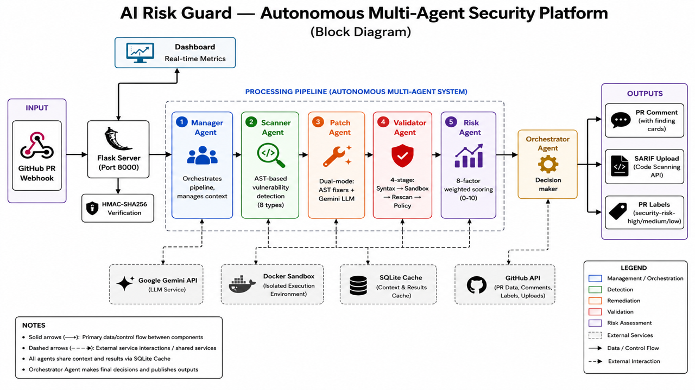
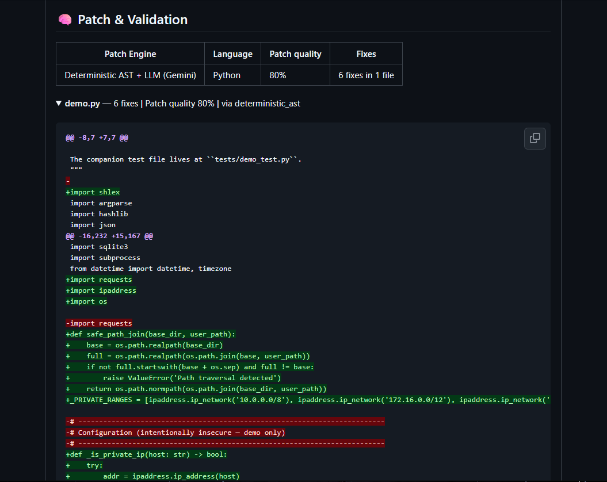
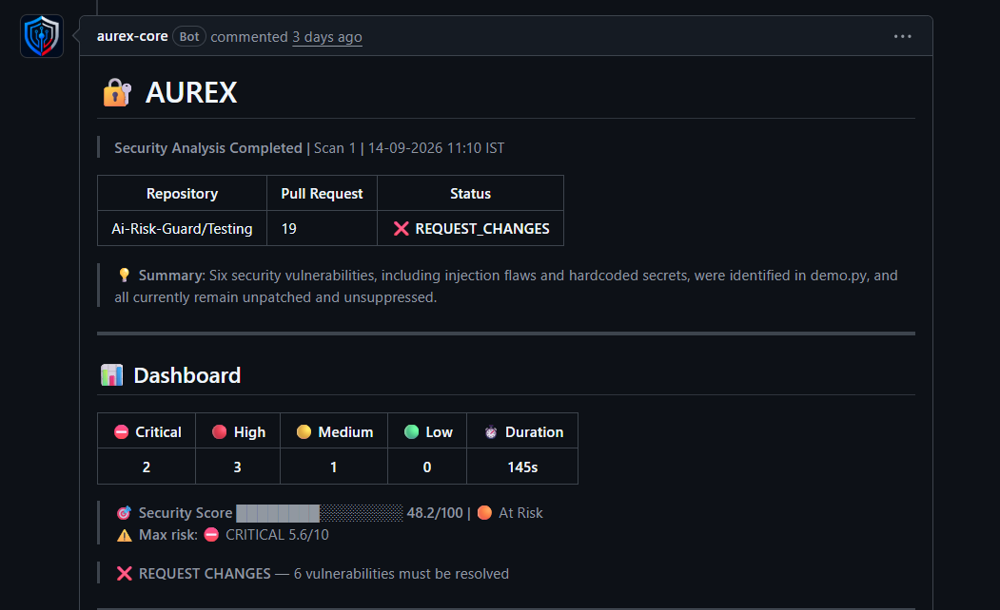
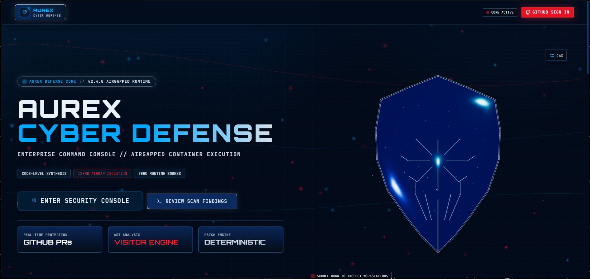

# AUREX

<p align="center">
  
</p>

<p align="center">
  <strong>Risk-aware security analysis and automated remediation for GitHub Pull Requests.</strong>
</p>

<p align="center">
  Detect vulnerabilities. Generate secure patches. Validate them in isolation. Quantify risk.
</p>

<p align="center">
  <a href="https://github.com/RalphRuban/AUREX">
    
  </a>
  
  
  
  
  
  
</p>

---

## Overview

**AUREX** is a GitHub-integrated security automation platform that analyzes Pull Requests for security vulnerabilities, generates remediation candidates, validates those candidates in an isolated Docker environment, and produces a risk-aware security decision.

Instead of treating an AI-generated patch as automatically trustworthy, AUREX separates the workflow into distinct stages:

<p align="center">
  
</p>

The result is a security workflow designed around **detection → remediation → validation → risk assessment**, rather than detection alone.

---

# Why AUREX?

Traditional static analysis tools are excellent at finding known patterns, but identifying a vulnerability is only one part of the problem.

A remediation system must also answer:

* What exactly changed in the Pull Request?
* Is the finding actually security-relevant?
* Can the vulnerability be safely remediated?
* Does the proposed patch preserve application behavior?
* Did the patch introduce another security issue?
* Can the patch execute safely?
* What is the remaining security risk?
* How confident is the system in its conclusion?

AUREX is designed around these questions.

> **AUREX does not treat generated code as trusted code.**
> A patch must be validated before it becomes a security decision.

---

# Core Capabilities

## 🔍 Diff-Aware Security Analysis

AUREX focuses analysis on the changes introduced by a Pull Request rather than blindly treating the entire repository as new attack surface.

The scanner combines:

* Python AST analysis
* Pattern-based security rules
* Changed-line analysis
* Context-aware validation
* Vulnerability classification
* CWE mapping
* Security metadata

---

## 🛡️ Vulnerability Detection

The current detection engine supports **10 vulnerability classes**:

| Vulnerability               | Classification            |
| --------------------------- | ------------------------- |
| Command Injection           | CWE-78                    |
| Code Injection              | CWE-94                    |
| SQL Injection               | CWE-89                    |
| Path Traversal              | CWE-22                    |
| Server-Side Request Forgery | CWE-918                   |
| Hardcoded Secrets           | CWE-798                   |
| Insecure Deserialization    | CWE-502                   |
| Weak Cryptography           | CWE-327                   |
| TLS Verification Disabled   | Security Misconfiguration |
| Debug Code                  | Security Misconfiguration |

The scanner is designed to distinguish security-relevant code from test/demo contexts where appropriate.

---

# 🤖 Multi-Agent Security Pipeline

AUREX separates responsibilities across specialized components rather than relying on a single AI call.

```text
                    ┌─────────────┐
                    │   Manager   │
                    └──────┬──────┘

             ┌─────────────┼─────────────┐
             ▼             ▼             ▼
        ┌─────────┐   ┌─────────┐   ┌─────────┐
        │ Scanner │   │  Patch  │   │Validator│
        │  Agent  │   │  Agent  │   │         │
        └────┬────┘   └────┬────┘   └────┬────┘
             │             │             │
             └─────────────┼─────────────┘
                           ▼
                    ┌─────────────┐
                    │ Risk Engine │
                    └──────┬──────┘
                           ▼
                    ┌─────────────┐
                    │ Orchestrator│
                    └─────────────┘
```

Each stage has a defined responsibility:

### Scanner

Identifies security issues in the Pull Request using AST and deterministic security rules.

### Patch Agent

Produces remediation candidates using deterministic AST fixers and, where appropriate, Gemini-assisted generation.

### Validator

Validates the candidate patch through static analysis, security rescanning, regression testing, policy checks, and isolated runtime execution.

### Risk Engine

Combines security characteristics and validation evidence into a risk and confidence assessment.

### Orchestrator

Coordinates the complete workflow and manages the state of the analysis.

---

# 🔧 Automated Remediation

AUREX uses a layered patching strategy.

### Deterministic AST remediation

Where a safe transformation is known, AUREX can use deterministic AST-based fixes.

This provides:

* Predictability
* Repeatability
* Reduced hallucination risk
* Structural code transformations

### Gemini-assisted remediation

For cases requiring more contextual reasoning, Gemini can generate remediation candidates and explanations.

The generated candidate is **not treated as trusted merely because an LLM produced it**.

It proceeds through validation before contributing to the final security decision.

---

# 🧪 Isolated Patch Validation

One of AUREX's key design principles is that generated code should not execute directly on the host.

Runtime validation is performed inside a Docker-based sandbox with resource and network restrictions.

```text
Generated Patch
      │
      ▼
┌─────────────────────┐
│ Docker Sandbox      │
│                     │
│ • Memory limits     │
│ • CPU limits        │
│ • Network disabled  │
│ • Restricted user   │
│ • Runtime isolation │
└──────────┬──────────┘
           │
           ▼
     Validation Evidence
```

The sandbox is designed to:

* Restrict memory
* Restrict CPU usage
* Disable network access
* Avoid host execution
* Clean up temporary containers
* Retry transient Docker failures
* Fail closed when runtime isolation is unavailable

**Docker is required for runtime sandbox validation.**

If Docker is unavailable, AUREX does not silently execute candidates on the host.

---

# 🔄 Multi-Layer Validation

AUREX validates remediation candidates through multiple stages.

```text
Patch Candidate
      │
      ▼
Syntax Validation
      │
      ▼
Security Rescan
      │
      ▼
Policy Validation
      │
      ▼
Regression Tests
      │
      ▼
Sandbox Runtime Validation
      │
      ▼
Patch Quality Assessment
```

This allows the system to distinguish between:

* A syntactically invalid patch
* A patch that still contains the original vulnerability
* A patch that introduces another issue
* A patch that fails regression tests
* A patch that passes static validation but fails at runtime
* A patch that successfully passes the available validation evidence

<p align="center">
  
</p>

---

# ☁️ CI Runner Validation

AUREX can use a GitHub-hosted Actions runner as a validation fallback when the application's local Docker environment is unavailable.

```text
AUREX
  │
  │ Docker unavailable
  ▼
GitHub Actions Runner
  │
  ├── Sandbox execution
  ├── Regression tests
  └── Runtime evidence
          │
          ▼
      AUREX Backend
          │
          ▼
      Re-analysis
          │
          ▼
     Updated PR Report
```

The returned runtime evidence is incorporated into the subsequent analysis and reflected in the GitHub PR result.

---

# ⚖️ Risk & Confidence Assessment

AUREX does not reduce security analysis to a simple vulnerability count.

Each analysis can produce:

* Risk score
* Confidence score
* Severity
* Vulnerability classification
* CWE mapping
* Validation status
* Patch quality information
* Runtime evidence

Conceptually:

```text
Detection
   +
Severity
   +
Context
   +
PR characteristics
   +
Validation evidence
   +
Confidence
        │
        ▼
   Risk Assessment
```

This enables AUREX to communicate not only:

> **"A vulnerability was found."**

but also:

> **"How significant is the finding, how confident is the system, and what evidence supports the remediation?"**

---

# 🐙 GitHub-Native Security Workflow

AUREX is designed to operate directly inside the Pull Request workflow.

It can provide:

### Pull Request Comments

Security findings are surfaced directly in the PR.

### Check Runs

Validation and security decisions can be represented through GitHub Checks.

### Risk Labels

Security findings can be reflected through GitHub labels.

### SARIF

Security results can be exported in SARIF format for GitHub Code Scanning integration.

### Automated Feedback

The application can process feedback and workflow actions associated with security findings.

The goal is to keep security feedback close to the developer's existing workflow rather than forcing developers into a separate security platform.

<p align="center">
  
</p>

---

# 📊 Security Dashboard

AUREX includes a React-based dashboard for monitoring security activity.

The dashboard exposes operational metrics including:

* Risk scores
* Remediation rate
* Cache hit rate
* Scan activity
* Validation state
* Security findings

<p align="center">
  
</p>

---

# 🔬 CodeQL Integration

AUREX can automatically provision a standard GitHub CodeQL workflow when configured to do so.

The workflow is added through a Pull Request and executed using GitHub's hosted infrastructure.

This allows AUREX to complement its own security analysis with GitHub's CodeQL ecosystem.

CodeQL provisioning can be controlled through:

```text
config/app.yaml
```

---

# 🧠 LLM-Assisted Regression Explanations

AUREX can use Gemini to transform detailed regression-test evidence into concise, developer-readable explanations.

Instead of displaying repetitive technical test output for every finding, the system can generate a plain-language explanation while retaining the complete technical details in an expandable section.

If Gemini is unavailable or rate-limited, the deterministic technical information remains available.

---

# 🏗️ Architecture

```text
                         ┌─────────────────────┐
                         │      GitHub         │
                         │       Pull Request  │
                         └──────────┬──────────┘
                                    │
                                    ▼
                         ┌─────────────────────┐
                         │    Flask Server     │
                         │   Webhook / API     │
                         └──────────┬──────────┘
                                    │
                                    ▼
                         ┌─────────────────────┐
                         │     Orchestrator    │
                         └──────────┬──────────┘
                                    │
                  ┌─────────────────┼─────────────────┐
                  ▼                 ▼                 ▼
           ┌────────────┐    ┌────────────┐    ┌────────────┐
           │  Scanner   │    │   Patch    │    │ Validator  │
           │   Agent    │    │   Agent    │    │            │
           └─────┬──────┘    └─────┬──────┘    └─────┬──────┘
                 │                 │                 │
                 ▼                 ▼                 ▼
            AST + Rules       AST + Gemini       Docker
                                                   Sandbox
                                                     │
                                                     ▼
                                            Runtime Evidence
                                                     │
                  ┌──────────────────────────────────┘
                  │
                  ▼
           ┌────────────────┐
           │  Risk Engine   │
           └───────┬────────┘
                   │
          ┌────────┼───────────┐
          ▼        ▼           ▼
       GitHub     SARIF     Dashboard
```

---

# 🛠️ Technology Stack

| Layer              | Technology                  |
| ------------------ | --------------------------- |
| Backend            | Python 3.13+                |
| Web Framework      | Flask 3.x                   |
| Frontend           | React 18                    |
| Language           | TypeScript 5                |
| Frontend Build     | Vite 6                      |
| Styling            | Tailwind CSS                |
| 3D / UI            | Three.js, GSAP              |
| Static Analysis    | Python AST + Security Rules |
| LLM                | Gemini                      |
| Runtime Isolation  | Docker                      |
| Database           | SQLite                      |
| CI/CD              | GitHub Actions              |
| Security Reporting | SARIF                       |
| Source Platform    | GitHub App                  |

---

# 🚀 Quick Start

## Prerequisites

Install:

* Python 3.13+
* Node.js 20+
* Docker
* A GitHub App
* Gemini API key if LLM-assisted remediation is required

Docker is required for sandbox runtime validation.

---

## 1. Clone the repository

```bash
git clone https://github.com/RalphRuban/AUREX.git
cd AUREX
```

---

## 2. Configure environment variables

Create your environment file:

```bash
cp .env.example .env
```

Configure the required GitHub App credentials:

```env
GITHUB_APP_ID=
GITHUB_PRIVATE_KEY=
GITHUB_WEBHOOK_SECRET=

GITHUB_APP_CLIENT_ID=
GITHUB_APP_CLIENT_SECRET=

GEMINI_API_KEY=
```

Additional configuration is documented in the environment variable section below.

---

## 3. Install backend dependencies

```bash
python -m pip install -r requirements.txt
```

Start the backend:

```bash
python app/app.py
```

The backend runs on:

```text
http://localhost:8000
```

---

## 4. Start the frontend

```bash
cd frontend
npm install
npm run dev
```

The Vite development server runs on:

```text
http://localhost:3000
```

---

## 5. Production frontend build

Build the frontend:

```bash
cd frontend
npm run build
```

The compiled frontend is placed under:

```text
static/frontend
```

Flask can then serve the frontend and backend together:

```bash
python app/app.py
```

---

# 🔐 GitHub App Configuration

Create a GitHub App from:

**GitHub → Settings → Developer settings → GitHub Apps**

Configure the webhook:

```text
https://<your-host>/webhook
```

Recommended repository permissions include:

| Permission      | Access       |
| --------------- | ------------ |
| Pull Requests   | Read & Write |
| Contents        | Read & Write |
| Checks          | Read & Write |
| Workflows       | Read & Write |
| Security Events | Read & Write |
| Metadata        | Read         |

Subscribe to:

```text
pull_request
installation
installation_repositories
```

Generate a private key and configure it through:

```env
GITHUB_PRIVATE_KEY=
```

Finally, install the GitHub App on the repositories you want AUREX to analyze.

---

# 🧪 Demo Vulnerable Application

The repository includes an intentionally vulnerable demonstration target:

```text
demo.py
```

It is designed to exercise the scanner against several vulnerability classes.

The demo includes examples involving:

* Hardcoded secrets
* SQL injection
* Command injection
* Path traversal
* SSRF
* Weak hashing

> **Important:** The credentials in the demo are intentionally non-production examples. They must never be treated as real credentials.

---

# 🧰 Development

Run the test suite:

```bash
python -m pytest tests/ -x -q
```

Run linting:

```bash
ruff check .
```

Run type checking:

```bash
mypy .
```

Build the frontend:

```bash
cd frontend
npm run build
```

---

# 📈 Observability

AUREX exposes operational metrics through its metrics endpoints.

Important sandbox metrics include:

```text
ai_risk_guard_sandbox_fail_closed_total
ai_risk_guard_sandbox_available
```

These can be used to monitor sandbox availability and identify Docker-related validation failures.

---

# ⚙️ Environment Variables

| Variable                   | Required   | Purpose                               |
| -------------------------- | ---------- | ------------------------------------- |
| `GITHUB_APP_ID`            | Yes        | GitHub App JWT authentication         |
| `GITHUB_PRIVATE_KEY`       | Yes        | JWT signing; PEM content or file path |
| `GITHUB_WEBHOOK_SECRET`    | Yes        | Webhook signature verification        |
| `GITHUB_APP_CLIENT_ID`     | Yes        | GitHub OAuth login                    |
| `GITHUB_APP_CLIENT_SECRET` | Yes        | OAuth token exchange                  |
| `FLASK_SECRET_KEY`         | Production | Session signing                       |
| `CI_VALIDATION_SECRET`     | Optional   | CI validation fallback authentication |
| `CI_VALIDATION_TOKEN`      | Optional   | GitHub token for repository dispatch  |
| `GEMINI_API_KEY`           | Optional   | LLM-assisted patch generation         |
| `GITHUB_APP_SLUG`          | Optional   | GitHub App installation link          |
| `SESSION_COOKIE_SECURE`    | Optional   | Secure session cookies over HTTPS     |
| `FRONTEND_ORIGIN`          | Optional   | Frontend CORS origin                  |
| `PORT`                     | Optional   | Server bind port                      |
| `DB_PATH`                  | Optional   | SQLite database location              |
| `APP_DASHBOARD_URL`        | Optional   | Dashboard URL used in reports         |
| `CI_VALIDATION_BASE_URL`   | Optional   | CI validation callback URL            |
| `SARIF_INFORMATION_URI`    | Optional   | Project URL embedded in SARIF         |
| `METRICS_SCRAPE_TOKEN`     | Optional   | Prometheus metrics authentication     |
| `LOG_LEVEL`                | Optional   | Logging level                         |
| `APP_ENV`                  | Optional   | Application environment               |
| `PROJ_ENV`                 | Optional   | Environment file selection            |
| `CONFIG_STRICT`            | Optional   | Strict configuration validation       |

---

# 🛡️ Security Design Principles

AUREX is built around several security principles.

### 1. Never trust generated code

LLM-generated patches are candidates, not trusted fixes.

### 2. Prefer deterministic remediation

Where possible, structured AST transformations are preferred over unconstrained generation.

### 3. Never execute untrusted candidates on the host

Runtime execution is isolated through Docker.

### 4. Fail closed

If the runtime sandbox cannot be established, AUREX does not silently fall back to host execution.

### 5. Separate detection from validation

Finding a vulnerability and proving that a remediation is safe are treated as separate operations.

### 6. Preserve evidence

Validation results, regression evidence, security rescans and runtime results contribute to the final decision.

---

# 🔄 Validation Failure Handling

AUREX is designed to handle infrastructure failures without falsely reporting a successful runtime validation.

When Docker becomes unavailable:

```text
Docker unavailable
       │
       ▼
Retry with backoff
       │
       ├── Docker returns
       │       │
       │       ▼
       │   Continue validation
       │
       └── Still unavailable
               │
               ▼
          Static-only result
               │
               ▼
        Deferred validation
               │
               ▼
       CI Runner fallback
```

This distinction is important:

> **A patch that has not been runtime-validated should not be presented as though it has been runtime-validated.**

---

# 📁 Project Structure

A simplified view of the project:

```text
AUREX/
│
├── app/
│   └── app.py
│
├── core/
│   ├── scanner/
│   ├── patch/
│   ├── validator/
│   ├── risk/
│   └── orchestration/
│
├── frontend/
│   ├── src/
│   └── ...
│
├── ci/
│   └── validate.py
│
├── config/
│   ├── app.yaml
│   └── sandbox.yaml
│
├── tests/
│
├── .github/
│   └── workflows/
│
├── demo.py
├── requirements.txt
├── .env.example
├── Deploy_Plan.md
└── README.md
```

---

# 📚 Documentation

Additional project documentation is available in the repository:

* `Documentation/` — architecture and project documentation
* `config/` — application and sandbox configuration
* `tests/` — automated test suite
* `.github/workflows/` — CI and validation workflows

---

# ⚠️ Current Scope & Limitations

AUREX is actively developed and should be treated as a security engineering project rather than a replacement for a complete enterprise AppSec program.

Important considerations:

* Detection is not guaranteed to identify every vulnerability.
* Automated remediation can produce incorrect candidates.
* Runtime validation depends on the available test and execution environment.
* Docker is required for local sandbox runtime validation.
* CI fallback requires additional GitHub Actions configuration.
* LLM-assisted functionality depends on Gemini availability and API configuration.
* Security findings should still be reviewed according to the risk tolerance of the target project.

AUREX is designed to **augment developer and security workflows**, not eliminate human security review.

---

# 🗺️ Roadmap

Planned development areas include:

* [ ] Expand language coverage beyond Python
* [ ] Broader AST-based vulnerability detection
* [ ] Improved context-aware remediation
* [ ] Advanced regression generation
* [ ] More comprehensive security benchmarks
* [ ] Precision / recall evaluation across vulnerability datasets
* [ ] Expanded CI/CD integrations
* [ ] Advanced risk modeling
* [ ] Continuous feedback-driven improvement
* [ ] Additional security rule families
* [ ] Expanded enterprise reporting

---

# 🎯 Design Philosophy

AUREX is built around a simple idea:

```text
        DETECT
           ↓
      UNDERSTAND
           ↓
       REMEDIATE
           ↓
        VALIDATE
           ↓
       MEASURE RISK
           ↓
      MAKE EVIDENCE-
      BASED DECISIONS
```

The goal is not simply to produce more security alerts.

The goal is to make security analysis **actionable, verifiable, and integrated into the developer workflow**.

---

# 📜 License

This project is licensed under the **MIT License**.

See [`LICENSE`](LICENSE) for details.

---

<p align="center">
  <strong>AUREX</strong>
  <br>
  Risk-aware security automation for GitHub.
  <br><br>
  <a href="https://github.com/RalphRuban/AUREX">GitHub Repository</a>
</p>
